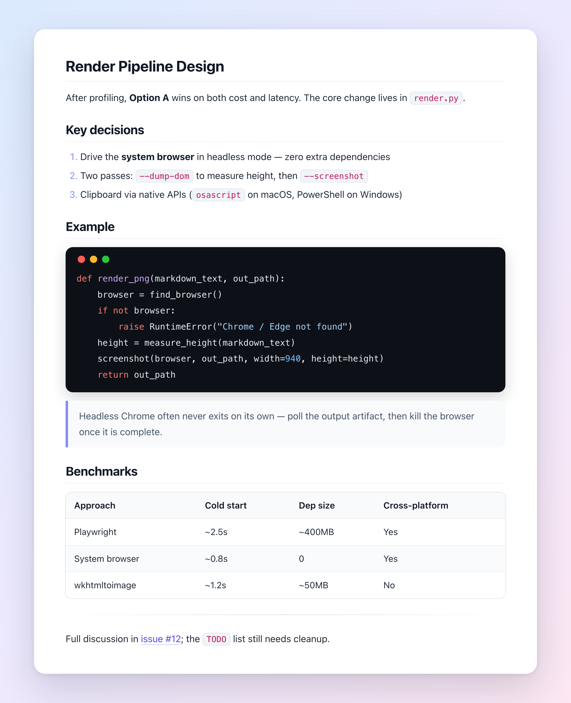

# copyimg

A [Codex CLI](https://github.com/openai/codex) plugin that copies the last assistant reply as a **rendered image** instead of raw Markdown — like the built-in `/copy`, but you get a PNG on your clipboard.



## Usage

In any Codex session, after a reply you want to keep:

```
$copyimg
```

(typing `$` in the composer opens the skill picker — pick `copyimg`; it submits as `$copyimg:copyimg`, that's normal)

That's it. The reply is rendered to a PNG and placed on the system clipboard, ready to paste into Slack, Docs, WeChat, anywhere. The success (or failure) message is shown right in the session.

> Why `$copyimg` and not `/copyimg`? The Codex TUI matches `/`-prefixed input against its built-in command list and rejects unknown commands locally — they never reach hooks. Skills, invoked with `$name`, are the supported user-invocable extension point. Typing the bare word `copyimg` also works.

## How it works

Codex CLI has no user-defined local slash commands, so `copyimg` emulates one with a bundled skill plus a `UserPromptSubmit` lifecycle hook:

1. You type `$copyimg`. Codex expands the bundled skill's body into the prompt; the hook intercepts it (via a marker in the skill body) before it reaches the model.
2. It parses the session transcript and extracts the last assistant message.
3. The Markdown is rendered in a page by the vendored [marked](https://github.com/markedjs/marked) and screenshotted with your **already-installed browser** (Chrome / Edge / Chromium) in headless mode — two one-shot launches: one to measure the page height via `--dump-dom`, one to take the `--screenshot` at 2x scale for retina displays.
4. The PNG is written to the clipboard — `osascript` on macOS, PowerShell on Windows.
5. The hook blocks the prompt, so **no tokens are spent** and nothing is sent to the model.

Any other prompt passes through untouched.

## Requirements

- Codex CLI with plugin + hook support (v0.128.0 or later recommended)
- Python 3 on the PATH — `python3` on macOS, the `py` launcher on Windows
- Chrome, Edge, or Chromium installed (Edge is preinstalled on Windows)
- macOS or Windows

**Zero third-party dependencies** — the hook is pure Python stdlib. Nothing to install, no browser download, no first-run setup.

## Install

```sh
# Add this repo as a marketplace
codex plugin marketplace add shyn/copyimg

# Install the plugin
codex plugin add copyimg@copyimg
```

Then restart Codex, open `/hooks`, and **review + trust** the copyimg hook (Codex skips untrusted plugin hooks by design).

To update later:

```sh
codex plugin marketplace upgrade copyimg
codex plugin remove copyimg@copyimg && codex plugin add copyimg@copyimg
```

## Uninstall

```sh
codex plugin remove copyimg@copyimg
codex plugin marketplace remove copyimg
```

## Development

```
├── .agents/plugins/marketplace.json   # marketplace manifest
├── plugins/copyimg/
│   ├── .codex-plugin/plugin.json      # plugin manifest
│   ├── skills/copyimg/SKILL.md        # `$copyimg` skill (carries the trigger marker)
│   └── hooks/
│       ├── hooks.json                 # UserPromptSubmit hook wiring
│       ├── copyimg.py                 # intercept → render → clipboard
│       ├── marked.min.js              # vendored markdown renderer (MIT)
│       └── highlight.min.js           # vendored syntax highlighter (BSD-3-Clause)
└── tests/
    ├── fake_rollout.jsonl             # sample Codex transcript
    └── smoke_test.py                  # end-to-end test, no Codex needed
```

Run the test suite locally (macOS and Windows):

```sh
python tests/smoke_test.py             # manifest + render tests
python tests/smoke_test.py --clipboard # also verify the clipboard write (macOS)
```

## Caveats

- The transcript (rollout jsonl) format is not a stable Codex interface. The parser accepts several known shapes, but a future Codex release may require an update here.
- Pages taller than 16000 px are cropped (browser window-size limit).
- Linux is not supported (no clipboard backend wired up) — contributions welcome.

## License

[MIT](LICENSE)
